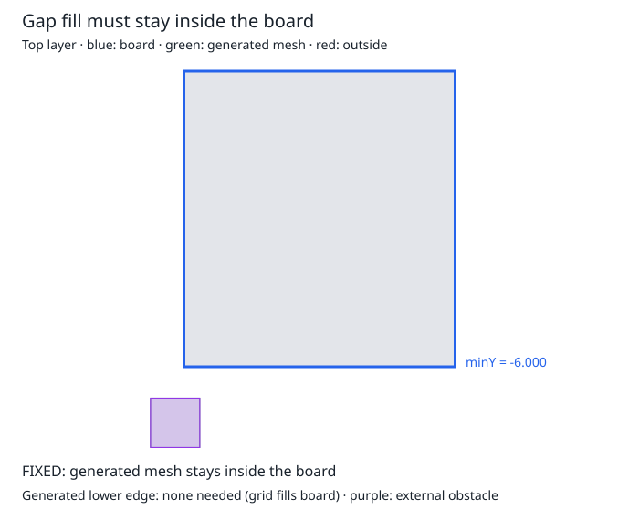

# Gap fill extends beyond the board

The existing `simplified-out-of-bounds-example.json` has a rectangular board with
minimum Y = -6 mm and a top-layer obstacle outside its lower-left corner.
The grid stage respects the board, but the gap-fill stage receives no rectangular
bounds. It searches outward until it meets a mesh node. Here the outside obstacle
acts as that stopping point: `new-cmn_0-0` reaches Y = -7.275436 mm, 1.275436 mm
outside the board. With no outline, there are no board-void rectangles to stop it.

Blue is the physical board, gray is existing mesh, green is generated mesh, red is
generated mesh crossing the lower edge, and purple is the external input obstacle.
The input obstacle remains visible intentionally: this bug is about *generated*
routing space, not rejecting external input obstacles.

Run `bun test tests/simplified-out-of-bounds-example.test.ts`. This characterization
asserts the current incorrect coordinate and records a fixed-viewport SVG. It is a
reproduction only; the follow-up fix will carry board bounds into gap filling,
limit expansion at the boundary, and replace the bug assertion with containment.
