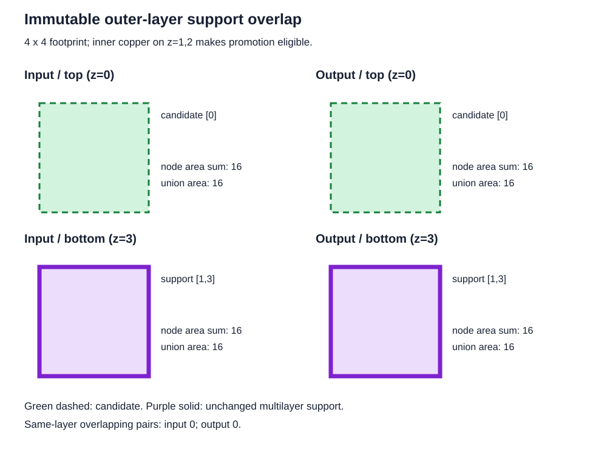

# Preserve multilayer support and routing area during promotion

This four-layer fixture starts with a 4-by-4 top candidate `[0]` and an
identically positioned free support node `[1, 3]`. They do not overlap on any
shared layer. Copper pours allow transit across the intermediate layers.

The original overlap reproduction treated the free multilayer support as
immutable. Promoting the candidate to `[0, 3]` while retaining that support
doubled bottom-layer area from 16 to 32. A conservative guard prevented the
overlap but also prevented useful transit.

The transit merge now consumes free support within the promoted footprint and
inherits its layers. This fixture produces one node on `[0, 1, 3]`. Every
layer retains exactly its input area, the existing inner-to-bottom transition
remains, and top-to-bottom transit is added without any shared-layer overlap.
The tests therefore assert this behavior rather than requiring rejection of
free multilayer support.

The eight panels show input and output separately on all four layers, including
the empty layer. The layer area labels expose lost or duplicated mesh area.

Regressions also cover the symmetric bottom promotion, mixed support that must
split at layer boundaries, larger support that must leave residual pieces,
and adjacent multilayer support. Every fixture checks area on all four layers,
absence of same-layer overlap, and preservation of every existing pairwise
layer transition. Explicit obstacle and target nodes must stay unchanged, must
not qualify as free opposite support, and must not block adjacent promotion.

Run: `bun test tests/solver/immutable-outer-overlap/immutable-outer-overlap.test.ts`
